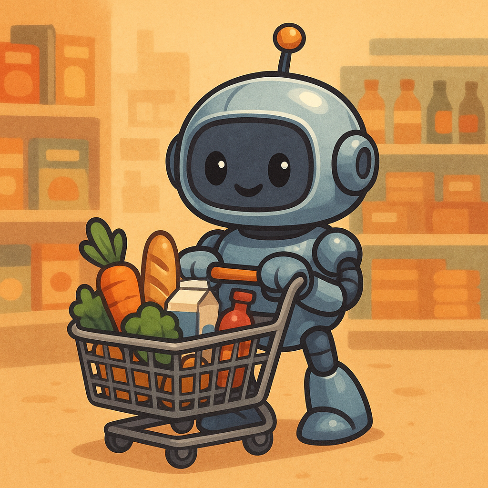

# Bolucompras List



Bolucompras List es una aplicación moderna y eficiente para gestionar listas de compras mensuales. Con una interfaz intuitiva y hermosa, permite a los usuarios gestionar sus productos de forma sencilla, con funcionalidades avanzadas como manejo de duplicados, categorización, y priorización de productos.

[](https://www.typescriptlang.org/)
[](https://nextjs.org/)
[](https://www.mongodb.com/)
[](https://expressjs.com/)

## Características Principales

- **Entrada de Productos**: Permite a los usuarios ingresar nombres de productos mediante un campo de texto.
- **Agregar Productos**: Agrega productos a la lista mediante un botón o la tecla Enter.
- **Visualización de la Lista**: Muestra la lista de compras actual con nombres y cantidades de productos.
- **Manejo de Duplicados**: Solicita confirmación antes de incrementar la cantidad de un producto ya existente.
- **Integración con Backend**: Operaciones CRUD básicas a través de API RESTful con Express y MongoDB.

## Funcionalidades Implementadas

- **Edición en la Tabla**: Las columnas "Comprado" y "Cantidad" son editables directamente desde la tabla.
  - La columna "Comprado" permite seleccionar entre "Sí" y "No" mediante un dropdown.
  - La columna "Cantidad" permite editar el valor directamente en un campo de entrada.
  - Los cambios se sincronizan automáticamente con el backend mediante solicitudes `PATCH`.

- **Paginación**: La tabla soporta paginación para manejar grandes cantidades de productos.
  - Los datos se cargan dinámicamente al navegar entre páginas.

- **Confirmación de Duplicados**: Al intentar agregar un producto ya existente, se muestra un modal de confirmación.
  - Si se confirma, la cantidad del producto se incrementa.
  - Si se cancela, no se realizan cambios en la lista ni en el backend.

## 🔜 Funcionalidades Avanzadas (Próximamente)

> **Nota:** Las siguientes funcionalidades están planificadas para futuras versiones.

- **Sugerencias Inteligentes de Productos**: Integración con APIs de IA para recibir recomendaciones basadas en tu historial de compras.
- **Análisis de Patrones de Compra**: Identifica productos comprados frecuentemente y sugiere cuándo es probable que necesites reabastecerlos.
- **Notificaciones Personalizadas**: Recibe alertas sobre productos que compras regularmente.
- **Integración con n8n**: Automatización de flujos de trabajo y notificaciones.

## Nuevas Funcionalidades y Mejoras

### Refactorización de Componentes
- **`AddProductForm`**: Componente modularizado para manejar la entrada de productos, categorías, y prioridades.
- **`ProductList`**: Componente dedicado para mostrar la lista de productos con estilos mejorados.

### Manejo de Productos Duplicados
- **Modal de Advertencia**: Implementación de un modal que se activa al detectar un producto duplicado.
  - Permite actualizar la categoría y prioridad del producto antes de confirmar.
  - Botones interactivos con efectos de hover y transiciones.

### Mejoras de UI
- **Estilos Modernos**: Uso de gradientes, efectos de hover y transiciones en botones, encabezados de tablas y campos de entrada.
- **Accesibilidad**: Se añadió un `DialogTitle` al modal para cumplir con los estándares de accesibilidad.

### Funcionalidad Dinámica
- **Alternar Visibilidad de la Lista**: Botón dinámico que permite mostrar u ocultar la lista de productos.
  - Cambia el texto entre "Ver Lista" y "Cerrar Lista" según el estado actual.

### Estructura del Código
- **`src/app/components/AddProductForm.tsx`**: Maneja la lógica de entrada de productos y el modal de duplicados.
- **`src/app/components/ProductList.tsx`**: Renderiza la tabla de productos con paginación y estilos mejorados.
- **`src/components/ui/dialog.tsx`**: Revisión y mejora del componente `Dialog` para asegurar su correcto funcionamiento.

### Scripts Actualizados
- `npm run dev`: Ahora incluye las nuevas funcionalidades y mejoras de UI.

### Cómo Usar las Nuevas Funcionalidades
1. **Agregar un Producto**:
   - Ingresa el nombre del producto en el campo de texto.
   - Selecciona la categoría y prioridad.
   - Haz clic en "Agregar Producto".
2. **Manejo de Duplicados**:
   - Si el producto ya existe, aparecerá un modal.
   - Actualiza la categoría y prioridad si es necesario.
   - Confirma o cancela la acción.
3. **Alternar Lista**:
   - Usa el botón "Ver Lista" o "Cerrar Lista" para mostrar u ocultar la tabla de productos.

## Reglas de Negocio

Las siguientes reglas de negocio se aplican en la aplicación Bolucompras List:

1. **Nombres de Productos Únicos**: No se permiten productos con nombres duplicados en la lista. Si se intenta agregar un producto con un nombre ya existente, se incrementará la cantidad del producto existente en lugar de agregar un duplicado.

2. **Cantidad No Negativa**: La cantidad de un producto no puede ser negativa. Si se intenta establecer una cantidad negativa, se mostrará un mensaje de error y no se aplicará el cambio.

3. **Rango de Prioridad**: La prioridad de un producto debe estar dentro del rango de 1 a 5. Cualquier valor fuera de este rango será rechazado.

Estas reglas aseguran la integridad de los datos y mejoran la experiencia del usuario al gestionar su lista de compras.

## Tecnologías Utilizadas

### Frontend
- **Framework**: Next.js (App Router) con React y TypeScript.
- **Estilos**: Tailwind CSS y Shadcn/ui para componentes de interfaz de usuario.
- **Gestión de Estado**: Hooks de React (`useState`, `useEffect`).

### Backend
- **API RESTful**: Express.js con Node.js para operaciones CRUD básicas.
- **Base de Datos**: MongoDB para almacenar productos y cantidades.

### Endpoints de API
- `GET /api/products`: Obtiene la lista de productos.
- `POST /api/products`: Agrega un nuevo producto.
- `PATCH /api/products/:id`: Actualiza un producto existente.
- `DELETE /api/products/:id`: Elimina un producto.

## Configuración del Proyecto

### Scripts Disponibles

- `npm run dev`: Inicia el servidor de desarrollo en el puerto 9002.
- `npm run build`: Construye la aplicación para producción.
- `npm run start`: Inicia la aplicación en modo producción.
- `npm run lint`: Ejecuta el linter.
- `npm run typecheck`: Verifica los tipos de TypeScript.
- `npm run server`: Inicia el servidor Express.

### Dependencias Principales

- **React**: ^18.3.1
- **Next.js**: 15.2.3
- **Tailwind CSS**: ^3.4.1
- **Shadcn/ui**: Componentes basados en Radix UI.
- **Express**: ^4.18.2
- **MongoDB**: ^6.1.0
- **Mongoose**: ^8.0.0

## Estructura del Proyecto

```
BoluCompras/
├── components.json
├── next.config.ts
├── package.json
├── README.md
├── tailwind.config.ts
├── tsconfig.json
├── docs/
│   └── blueprint.md
├── src/
│   ├── app/
│   │   ├── globals.css
│   │   ├── layout.tsx
│   │   └── page.tsx
│   ├── components/
│   │   └── ui/
│   │       ├── button.tsx
│   │       ├── card.tsx
│   │       ├── table.tsx
│   │       └── ...
│   ├── hooks/
│   │   └── use-toast.ts
│   └── lib/
│       └── utils.ts
├── server/
│   ├── index.js
│   ├── models/
│   │   └── Product.js
│   ├── routes/
│   │   └── products.js
│   └── config/
│       └── db.js
└── tests/
    ├── addProduct.spec.ts
    ├── happyPath.spec.ts
    ├── update-purchased.spec.ts
    └── pages/
        └── ProductPage.ts
```

## Cómo Empezar

### Requisitos Previos
- Node.js 18+ instalado
- Docker y Docker Compose (opcional, para desarrollo con contenedores)
- Cuenta en MongoDB Atlas (o MongoDB local)

### 1. Clonar e Instalar

```bash
git clone <url-del-repositorio>
cd BoluCompras
npm install
```

### 2. Configurar Variables de Entorno

Crea un archivo `.env` en la raíz del proyecto:

```env
# MongoDB Atlas (recomendado)
MONGO_URI=mongodb+srv://<usuario>:<password>@<cluster>.mongodb.net/bolucompras?retryWrites=true&w=majority

# O MongoDB Local
# MONGO_URI=mongodb://localhost:27017/bolucompras

PORT=9002
```

---

## 🚀 Levantar el Proyecto

### Opción A: Desarrollo Local (Recomendado)

Necesitas **2 terminales**:

```bash
# Terminal 1 - Backend (Express + MongoDB)
npm run server
```

```bash
# Terminal 2 - Frontend (Next.js)
npm run dev
```

📍 **URLs:**
- Frontend: http://localhost:9002
- Backend API: http://localhost:9002/api/products

---

### Opción B: Docker (Todo en un comando)

```bash
# Levantar todos los servicios
docker-compose up --build

# O en segundo plano
docker-compose up -d --build
```

```bash
# Para detener
docker-compose down
```

📍 **URLs:**
- Frontend: http://localhost:3000
- Backend API: http://localhost:9002/api/products

---

### Opción C: Solo Backend con Docker

```bash
docker-compose up backend --build
```

---

## 🧪 Ejecutar Tests

```bash
# Ejecutar todos los tests
npm test

# Ejecutar tests con UI de Playwright
npm run test:ui
```

---

## 🧭 Ver Base de Datos con MongoDB Compass

1. Descarga [MongoDB Compass](https://www.mongodb.com/products/compass)
2. Conecta usando tu string de conexión:
   ```
   mongodb+srv://<usuario>:<password>@<cluster>.mongodb.net/bolucompras
   ```
3. Explora la colección `products` en tiempo real

## Configuración de MongoDB Atlas (Gratuito)

1. Crea una cuenta en [MongoDB Atlas](https://www.mongodb.com/cloud/atlas)
2. Crea un cluster gratuito (M0)
3. Configura un usuario y contraseña para la base de datos
4. Configura el acceso de red (IP Whitelist)
5. Obtén tu string de conexión y añádelo al archivo `.env`

## Notas Adicionales

- La aplicación está optimizada para operaciones CRUD básicas con Express y MongoDB.
- Para entornos de producción, considera implementar autenticación de usuarios.
- Las funcionalidades avanzadas (IA, notificaciones) están planificadas para futuras versiones.

## Licencia

Este proyecto está bajo la licencia MIT.